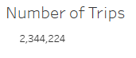
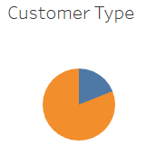
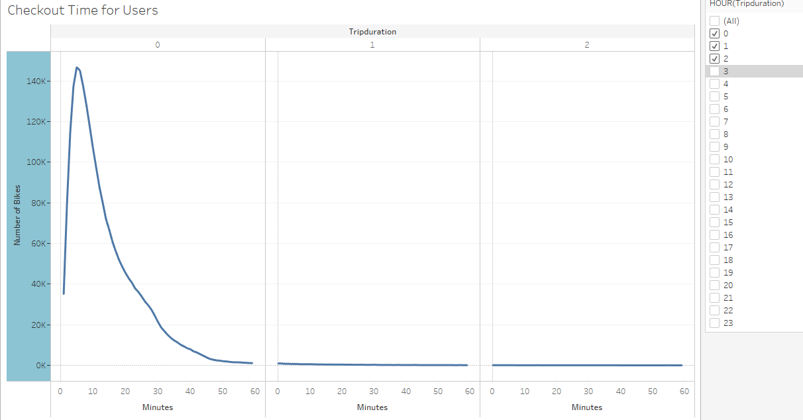
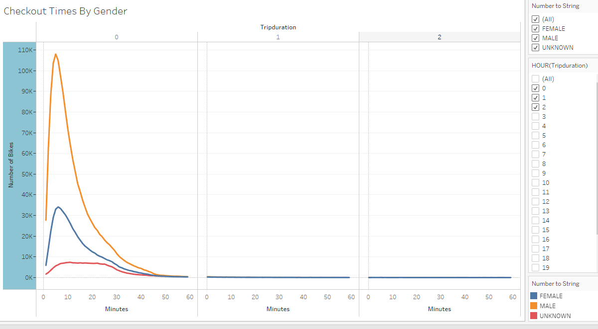
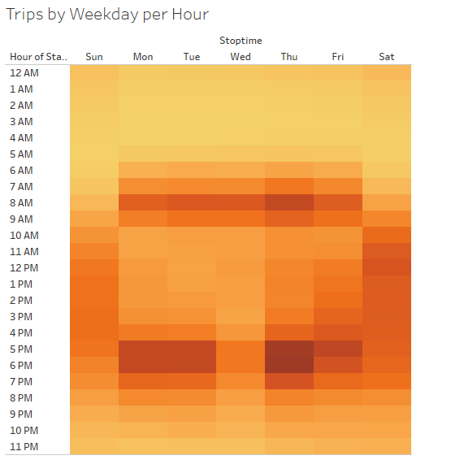
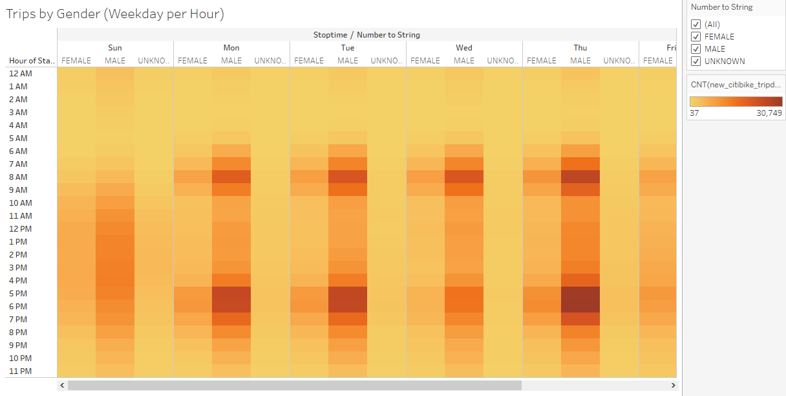
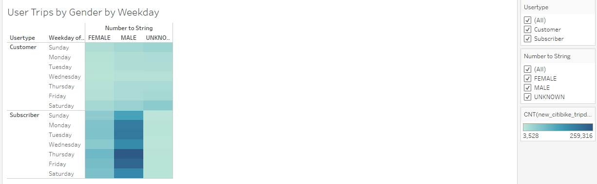

# Bike Sharing
## Overview of the analysis
The purpose of the analysis is to use data from the Citi Bike program in New York City and analyze the data to see trends and see if a bike riding service in Des Moines would be a good idea.

## Results
### Link to Tableau Story
[link to dashboard](https://public.tableau.com/app/profile/morgan.melnick/viz/BikeSharing_16277415866980/Story1?publish=yes)

### Visualizations 

- Overall there were a large number of trips

 

- The majority of the users subscribe to the bikes

 

- The majority of subscribers are male

 

- The majority of bikes are used for trips under an hour in length

 

- Males are more likely to be riding the bikes than females for trips under an hour
 

- Thursdays from 5-7PM are the most popular times for a bike ride
 

- Males use the bikes more and attribute to Thursdays PM popularity 
 

## Summary
Overall, this data set confirms that bike programs are useful and used by customers. It is also shown that males prefer to use this service and that the peak times are weekdays from 5-7PM and most trips last under an hour. Another chart we could pull together would like at the start station and see if there is a certain area of the city is more popular. If there is a location that is more popular we could look to see if there is a similar city plot in Des Moines. It would be interesting to see if a lot of bikes are used for commuting to and from work. Another visualization we could look at BikeIds and how far/frequently they are able to be used. 
